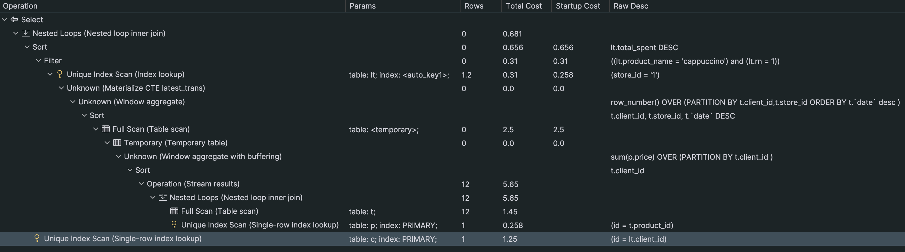

# Transaction Processing Script

---
A Python CLI tool for managing a transactions database, uploading CSV data, and querying for results. This tool allows
you to:

- Setup the MySQL database and tables for transaction management.
- Upload a transactions CSV file into a temporary staging table, fix any data, and then load the cleaned data into the
  final tables.
- Query the database for the latest transactions and total amounts spent by customers at a given store for a certain
  product.

---

## Table of Contents

1. [Data Model](#data-model)
2. [Setup](#setup)
3. [Findings and Key Decisions](#findings-and-key-decisions)
4. [Usage](#usage)
    - [CLI Commands](#cli-commands)
    - [Command Options and Examples](#command-options-and-examples)
5. [SQL Commands Reference](#sql-commands-reference)
    - [Database and Table Creation](#database-and-table-creation)
    - [Data Insert/Update](#data-insertupdate)
    - [Queries](#queries)

## Requirements

1. **Python 3.x** installed on your system.
2. **MySQL Server** (locally or remotely accessible).
3. **`mysql-connector-python`** library for Python (install via `pip install mysql-connector-python`).
4. A **CSV file** to import (by default, the script points to `./transactions.csv`).

The CSV file must contain the following columns with exact column names:

| Column Name               | Example Value | Description                                               |
|---------------------------|---------------|-----------------------------------------------------------|
| transaction_id            | TX1234        | Unique ID for each transaction (any alphanumeric string). |
| transaction_date          | 2023-01-15    | Date of the transaction in YYYY-MM-DD format.             |
| product_name              | cappuccino    | Name of the product purchased.                            |
| price                     | 4.50          | Price of the product (decimal value).                     |
| store_name                | King St       | Name of the store where the sale occurred.                |
| sales_representative_name | John Smith    | Sales representative who facilitated the transaction.     |
| client_name               | Jane Doe      | Client/Customer name.                                     |

## Data Model

The script creates and manages the following tables where the database is normalized to the 3<sup>rd</sup> normal form:

<p>
   
</p>

**Staging table**:
<p>
   
</p>

The `transactions_temp` table is used for staging data from the CSV. Once loaded, data can be adjusted or fixed (e.g.,
updating certain prices) before being inserted into the final tables (`stores`, `clients`, `products`,
`sales_representatives`, and `transactions`).

## Findings and Key Decisions

- Based on the given CSV file Clients, Stores, Sales Representatives can be uniquely identified by their names only. 
This is enforced with UNIQUE indexing in the tables.
- While exploring the data, I noticed that the price of `cappuccino` for transaction with `id q232` (4.00) does not 
match is not consistent with pricing in other transactions across stores and customers. To fix the issue before 
inserting data to the tables, `update` query is run to set prices for cappuccinos in staging table to 4.50 - majority rule.
- Additionally, because of the price mismatch, the product prices might change from store to store. To be able to correctly
identify product across the stores, a composite index is crated on product-name and store-id in products. This will enforce
that product with the same name cannot have different prices at the same store.
- The UNIQUE constraint on names will optimize the queries, since the queries are parameterized by names. (e.g. store - King St, product - tea).

---

- When setting up the database I believe I have already introduced enough constraints. For now the amount of data is tiny
and to introduce further constraints will not have any noticeable gains. If under real workload the performance suffers
then further indexing might be considered. This is also the reason why some of the obvious `foreign key` relations have not
been modeled, such as `sales representative -> store` or `customer -> store`, since I do not believe that they are necessary
for the purposes of task while introducing extra complexity.
- The `get_customers` query has cost of `1.7`, `get_customers_sort` query has cost of `3.03`. For both queries cost of `0.566` 
is result of `Correlated Subquery`, which is evaluated for every row.
- The `get_customers_sort` query does `Unique Index Scan (Index lookup)` twice wih cost of about `0.5`.
- I optimized `get_customers_sort_optim` by using `window functions` and `CTE` to progressively build the final table
and avoid duplicate joins. Window functions are used since they generally faster than correlated subqueries. The final
result is cost of `0.681` for optimized query.

P.S. I would like to note that performance gains for optimized query will be noticeable with large amounts of data. 
Some of the optimization constraints might be unnecessary if the table has limited number of rows.

## Setup

### Create a Python Virtual Environment

```sh
python -m venv .venv
source .venv/bin/activate
```

### Install Dependencies

Make sure you have MySQL installed and a running MySQL server. Then install the Python dependencies:

```sh
pip install mysql-connector-python
```

## Usage

The script uses a sub-command style CLI:

```sh
python transactions_manager.py [OPTIONS] <SUBCOMMAND> [SUBCOMMAND OPTIONS]
```

### CLI Commands

| Command  | Description                                                                                               |
|----------|-----------------------------------------------------------------------------------------------------------|
| `setup`  | Creates (if needed) a specified database and all required tables.                                         |
| `upload` | Uploads CSV data into the database (via `transactions_temp` table) and then inserts it into final tables. |
| `query`  | Performs a predefined query on the database to retrieve data.                                             |

### Command Options and Examples

Below is a list of the common options and specific sub-command options:

| Option                   | Default            | Description                                      |
|--------------------------|--------------------|--------------------------------------------------|
| `--db-user`              | root               | MySQL username                                   |
| `--db-password`          | (empty string)     | MySQL password                                   |
| `--db-host`              | 127.0.0.1          | MySQL host                                       |
| `--db-port`              | 3306               | MySQL port                                       |
| `--db-name`              | transactions       | Name of the database to create/use               |
| `--csv-file (upload)`    | ./transactions.csv | Path to CSV file containing transaction data     |
| `--query-name (query)`   | get_customers      | Which query to execute (see [Queries](#queries)) |
| `--store-name (query)`   | King St            | Store name to filter queries                     |
| `--product-name (query)` | cappuccino         | Product name to filter queries                   |

### Examples

1. **Setting up the Database**
   ```sh
   python transactions_manager.py \
      --db-user root \
      --db-password mypassword \
      --db-host 127.0.0.1 \
      --db-port 3306 \
      setup \
      --db-name transactions
   ```
   What happens:
    1. Connects to MySQL using the provided credentials.
    2. Creates the `transactions` database (if not already present).
    3. Switches to use the `transactions` database.
    4. Creates the required tables (`clients`, `sales_representatives`, `stores`, `products`, `transactions`,
       `transactions_temp`) if they do not exist.

2. **Uploading CSV Data**
   ```sh
   python transactions_manager.py \
      --db-user root \
      --db-password mypassword \
      --db-host 127.0.0.1 \
      --db-port 3306 \
      upload \
      --db-name transactions \
      --csv-file ./my_transactions.csv
   ```
   What happens:
    1. Connects to MySQL and switches to the `transactions` database.
    2. Reads data from `my_transactions.csv`.
    3. Loads all rows into `transactions_temp`.
    4. Performs any fix-ups on the temp data (for example, updating the price for certain products).
    5. Inserts new stores, clients, products, and sales representatives into their respective tables if they don’t
       already exist.
    6. Inserts the transactions into the `transactions` table.

3. **Querying**
   ```sh
   python transactions_manager.py \
      --db-user root \
      --db-password mypassword \
      --db-host 127.0.0.1 \
      --db-port 3306 \
      query \
      --db-name transactions \
      --store-name "King St" \
      --product-name "cappuccino" \
      --query-name get_customers_sort
   ```
   What happens:
    1. Connects to MySQL and switches to the `transactions` database.
    2. Runs the specified query (`get_customers_sort`) against the transactions data.
    3. Outputs the results to the console in a formatted table showing the `client_id`, `client_name`,
       `transaction_date`, and `total_spent` in descending order of total spent.

## SQL Commands Reference

### Database and Table Creation

- **Create Database**
   ```sql
   CREATE DATABASE <DB_NAME>;
   ```
- **Use Database**
   ```sql
   USE <DB_NAME>;
   ```
- **Tables**
   ```sql
   CREATE TABLE IF NOT EXISTS clients (
      id INT AUTO_INCREMENT PRIMARY KEY,
      name VARCHAR(255) UNIQUE NOT NULL
   );

   CREATE TABLE IF NOT EXISTS sales_representatives (
      id INT AUTO_INCREMENT PRIMARY KEY,
      name VARCHAR(255) UNIQUE NOT NULL
   );

   CREATE TABLE IF NOT EXISTS stores (
      id INT AUTO_INCREMENT PRIMARY KEY,
      name VARCHAR(255) UNIQUE NOT NULL
   );

   CREATE TABLE IF NOT EXISTS products (
      id INT AUTO_INCREMENT PRIMARY KEY,
      name VARCHAR(255) NOT NULL,
      price DECIMAL(10,2) NOT NULL,
      store_id INT NOT NULL,
  
      FOREIGN KEY (store_id) REFERENCES stores(id),
      UNIQUE KEY product_store_idx (store_id, name)
   );

   CREATE TABLE IF NOT EXISTS transactions (
      id VARCHAR(128) PRIMARY KEY,
      date DATE NOT NULL,
      product_id INT NOT NULL,
      store_id INT NOT NULL,
      client_id INT NOT NULL,
      sales_repr_id INT NOT NULL,
  
      FOREIGN KEY (product_id) REFERENCES products(id),
      FOREIGN KEY (store_id) REFERENCES stores(id),
      FOREIGN KEY (client_id) REFERENCES clients(id),
      FOREIGN KEY (sales_repr_id) REFERENCES sales_representatives(id)
   );

   CREATE TABLE IF NOT EXISTS transactions_temp (
      transaction_id VARCHAR(128) PRIMARY KEY,
      transaction_date DATE NOT NULL,
      product_name VARCHAR(255) NOT NULL,
      price DECIMAL(10,2) NOT NULL,
      store_name VARCHAR(255) NOT NULL,
      sales_representative_name VARCHAR(255) NOT NULL,
      client_name VARCHAR(255) NOT NULL
   );
   ```

### Data Insert/Update

- **Insert into `transactions_temp`**
   ```sql
   INSERT INTO transactions_temp
   VALUES (%s, %s, %s, %s, %s, %s, %s);
   ```

- **Update or Fix `transactions_temp`**
   ```sql
   UPDATE transactions_temp
   SET price = 4.50
   WHERE product_name = 'cappuccino';
   ```
- **Insert into final tables**
    - `stores`
    - `sales_representatives`
    - `clients`
    - `products`
    - `transactions`

   ```sql
   INSERT IGNORE INTO stores (name)
   SELECT DISTINCT t.store_name
   FROM transactions_temp t
   WHERE NOT EXISTS (
      SELECT 1 FROM stores s WHERE s.name = t.store_name
   );
   ```

   ```sql
   INSERT IGNORE INTO sales_representatives (name)
   SELECT DISTINCT t.sales_representative_name
   FROM transactions_temp t
   WHERE NOT EXISTS (
      SELECT 1 FROM stores s WHERE s.name = t.sales_representative_name
   );
   ```

   ```sql
   INSERT IGNORE INTO clients (name)
   SELECT DISTINCT t.client_name
   FROM transactions_temp t
   WHERE NOT EXISTS(
      SELECT 1 FROM clients c WHERE c.name = t.client_name
   );
   ```

   ```sql
   INSERT IGNORE INTO products (name, price, store_id)
   SELECT DISTINCT t.product_name, t.price, s.id
   FROM transactions_temp t
   JOIN stores s ON t.store_name = s.name
   WHERE NOT EXISTS (
      SELECT 1 FROM products p WHERE p.name = t.product_name
   );
   ```

   ```sql
   INSERT IGNORE INTO transactions
   SELECT
      t.transaction_id,
      t.transaction_date,
      p.id AS product_id,
      s.id AS store_id,
      c.id AS client_id,
      sr.id AS sales_repr_id
   FROM transactions_temp t
   JOIN stores s ON t.store_name = s.name
   JOIN products p ON t.product_name = p.name AND p.store_id = s.id
   JOIN clients c ON t.client_name = c.name
   JOIN sales_representatives sr ON t.sales_representative_name = sr.name;
   ```

These insertions are done using `INSERT IGNORE` to avoid duplicating records if they already exist.

### Queries

1. `get_customers`
   ```sql
   SELECT c.id as client_id,
         c.name as client_name,
         t.date as transaction_date,
         p.name as product
   FROM clients c
   JOIN transactions t ON t.client_id = c.id
   JOIN stores s ON s.id = t.store_id
   JOIN products p ON p.id = t.product_id
   WHERE s.name = '{store_name}'
     AND p.name = '{product_name}'
     AND t.date = (
        SELECT MAX(date)
        FROM transactions t2
        WHERE t2.client_id = t.client_id
         AND t2.store_id = t.store_id
     );
   ```

    - Execution plan:
       <p>
        
       </p>
    
---

2. `get_customers_sort`
   ```sql
    WITH latest_trans AS
        (SELECT t.id,
                t.client_id,
                t.store_id,
                t.product_id,
                t.date,
                ROW_NUMBER() OVER (PARTITION BY t.client_id, t.store_id ORDER BY t.date DESC) AS rn
         FROM transactions t),
    
        total_spent AS
            (SELECT t.client_id,
                    SUM(p.price) AS total_spent
             FROM transactions t
                 JOIN products p ON t.product_id = p.id
             GROUP BY t.client_id
         )
    SELECT c.id,
           c.name,
           lt.date,
           ts.total_spent as total_spent
    FROM latest_trans lt
        JOIN total_spent ts ON ts.client_id = lt.client_id
        JOIN clients c ON lt.client_id = c.id
        JOIN stores s ON lt.store_id = s.id
        JOIN products p ON lt.product_id = p.id
    WHERE lt.rn = 1
      AND s.name = '{store_name}'
      AND p.name = '{product_name}'
    ORDER BY total_spent DESC;
    ```

    - Execution plan:
      <p>
        
      </p>
    
---

3. `get_customers_sort_optim`
   ```sql
    WITH latest_trans AS
        (SELECT t.id,
                t.client_id,
                t.store_id,
                t.product_id,
                t.date,
                p.name AS product_name,
                SUM(p.price) OVER (PARTITION BY t.client_id) as total_spent,
                ROW_NUMBER() OVER (PARTITION BY t.client_id, t.store_id ORDER BY t.date DESC) AS rn
         FROM transactions t
         JOIN products p ON t.product_id = p.id)
    
    SELECT c.id,
           c.name,
           lt.date,
           lt.total_spent as total_spent
    FROM latest_trans lt
        JOIN clients c ON lt.client_id = c.id
        JOIN stores s ON lt.store_id = s.id
    WHERE lt.rn = 1
      AND s.name = '{store_name}'
      AND lt.product_name = '{product_name}'
    ORDER BY total_spent DESC;
    ```

    - Execution plan:
      <p>
        
      </p>
